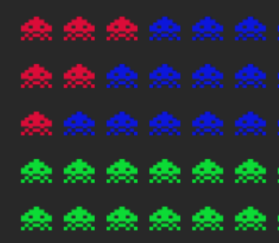

# Alien Invaders
A fun game made in vanilla JavaScript and the Canvas API. The animations are running using the `requestAnimationFrame` frunction and all objects are constantly being tracked for collision detection.

## Key Features
At the beginning you can choose any of the three battleships. 


The game kicks off with the objective of destroying all invading aliens before they make contact with your ship. As players progress to higher levels, aliens gain additional lives and change color based on their remaining life count. 



Periodically, players receive ammo upgrade drops, enabling battleships to shoot up to three bullets simultaneously.


### Adding Levels

Expanding the game with new levels is conveniently achievable through the `levels.js` file. Each level is represented by a 2D array, where the first dimension denotes rows and the second represents individual aliens. Aliens are assigned values of 0, 1, or 2, indicating their respective life count.
```js

const levelFour = [
    [2, 2, 2, 2, 2, 2, 2, 2, 2, 2, 2, 2, 2, 2],
    [2, 1, 1, 1, 1, 1, 1, 1, 1, 1, 1, 1, 1, 2],
    [2, 1, 1, 1, 1, 1, 1, 1, 1, 1, 1, 1, 1, 2],
    [2, 1, 1, 1, 1, 1, 1, 1, 1, 1, 1, 1, 1, 2],
    [2, 2, 2, 2, 2, 2, 2, 2, 2, 2, 2, 2, 2, 2],
]
```

## Try It Out
The games is available to play on [this link](https://alien-invaders-af.netlify.app/).